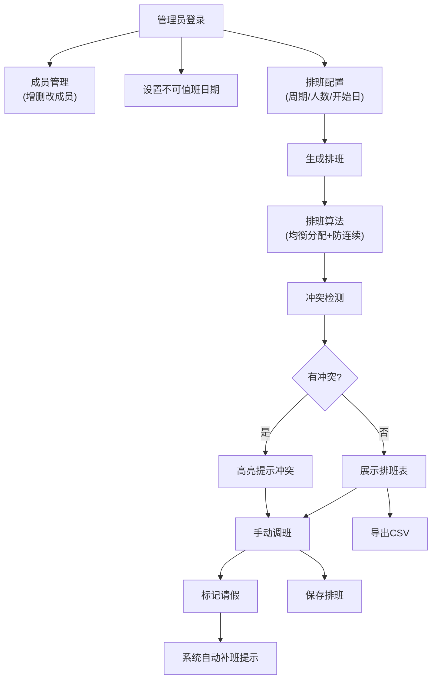

## 1. 产品概述

小团队值班排班与调班系统，用于自动化生成和维护团队值班表，解决手动排班效率低、冲突多、分配不均的问题。目标用户为团队管理员和值班成员，核心价值在于实现公平、高效、透明的排班管理。

- 主要用途：录入成员信息与不可值班日期，系统智能生成排班建议，支持手动调班、标记请假和导出CSV
- 解决问题：手动排班的繁琐、班次分配不均、连续值班冲突、请假调班流程混乱
- 目标用户：小团队（5-20人）的管理员和值班成员
- 产品价值：提升排班效率80%，确保班次公平分配，减少排班冲突90%

## 2. 核心功能

### 2.1 用户角色

| 角色 | 登录方式 | 核心权限 |
|------|----------|----------|
| 管理员 | 直接访问（单用户系统） | 成员管理、排班设置、生成排班、调班审批、标记请假、导出CSV、查看所有排班 |

### 2.2 功能模块

1. **仪表盘**：排班概览、统计信息、快捷操作入口
2. **成员管理**：增删改查成员信息、设置不可值班日期
3. **排班设置**：配置排班周期、每日所需人数、开始日期
4. **排班表**：查看排班日历、生成排班、手动调班、标记请假
5. **导出中心**：导出排班表为CSV格式

### 2.3 页面详情

| 页面名称 | 模块名称 | 功能描述 |
|----------|----------|----------|
| 仪表盘 | 统计面板 | 显示总人数、本期值班天数、每人值班次数统计、即将到来的值班 |
| 仪表盘 | 快捷操作 | 快速跳转至成员管理、排班设置、生成排班、导出CSV |
| 成员管理 | 成员列表 | 显示所有成员，支持新增、编辑、删除成员 |
| 成员管理 | 不可值班日期 | 为每个成员设置不可值班日期（单个日期或日期范围） |
| 排班设置 | 周期配置 | 设置排班开始日期、排班周期（天数）、每日所需值班人数 |
| 排班设置 | 算法参数 | 配置排班生成算法参数（最大连续值班天数、均衡度权重） |
| 排班表 | 日历视图 | 以日历/表格形式展示排班，按日期显示值班人员 |
| 排班表 | 排班生成 | 一键生成排班，显示生成结果和冲突提示 |
| 排班表 | 手动调班 | 拖拽或选择交换两人的值班日期，实时检测冲突 |
| 排班表 | 请假标记 | 为成员标记请假，系统自动提示需要补班 |
| 排班表 | 冲突提示 | 高亮显示连续值班、不可值班日期冲突、人数不足等问题 |
| 导出中心 | CSV导出 | 选择日期范围导出排班表为CSV文件 |

## 3. 核心流程

### 3.1 排班生成流程

管理员录入成员信息 → 设置不可值班日期 → 配置排班参数 → 点击生成排班 → 系统执行排班算法 → 检查并提示冲突 → 展示排班结果 → 手动调整 → 确认保存

### 3.2 调班流程

在排班表中选择需要调整的班次 → 选择目标成员或日期 → 系统检测冲突（连续值班、不可日期、人数） → 无冲突则完成调班 → 有冲突则提示原因 → 确认或取消

### 3.3 请假处理流程

选择请假成员和日期 → 标记为请假 → 系统提示需要补班 → 选择补班人员或让系统自动调整 → 更新排班表

### 3.4 Mermaid 流程图

## 4. 用户界面设计

### 4.1 设计风格

- **主色调**：深蓝色 (#1e3a5f) - 代表专业、可靠、稳重
- **辅助色**：青绿色 (#2dd4bf) - 用于强调操作按钮和成功状态
- **警告色**：橙红色 (#f97316) - 用于冲突提示和警告
- **背景色**：浅灰蓝 (#f8fafc) - 清爽的工作环境
- **卡片背景**：纯白色 (#ffffff) - 清晰的内容区域
- **按钮风格**：圆角 (8px)、微阴影、悬停时有轻微上浮效果
- **字体**：标题使用 "Noto Sans SC"，正文使用 "PingFang SC"，数字使用等宽字体
- **布局风格**：侧边导航 + 主内容区，卡片式布局，清晰的视觉层级
- **图标风格**：线性图标，统一24px尺寸，颜色与主题一致

### 4.2 页面设计概述

| 页面名称 | 模块名称 | UI元素 |
|----------|----------|--------|
| 仪表盘 | 统计面板 | 4个数据卡片（总成员、排班天数、今日值班、本周值班），柱状图展示每人值班次数，列表展示即将值班 |
| 仪表盘 | 快捷操作 | 4个大尺寸快捷按钮，带有图标和渐变背景 |
| 成员管理 | 成员列表 | 表格展示，每行显示成员姓名、部门、不可值班日期数量，操作按钮（编辑、删除、设置不可日期） |
| 成员管理 | 不可值班日期 | 模态框，日历选择器，支持多选日期和日期范围，标签式展示已选日期 |
| 排班设置 | 配置表单 | 日期选择器、数字输入框、滑块控件（算法参数），说明文字提示各参数作用 |
| 排班表 | 日历视图 | 月视图日历，每个日期格子显示值班人员头像和姓名，冲突日期用红色边框高亮 |
| 排班表 | 操作工具栏 | 生成排班按钮、日期切换、视图切换、导出按钮、调班模式开关 |
| 排班表 | 调班面板 | 右侧抽屉式面板，显示当前选中班次信息，可选择替换人员，实时冲突检测结果 |
| 排班表 | 请假标记 | 右键菜单或操作按钮，选择请假后显示请假图标，提示补班选项 |
| 导出中心 | 导出表单 | 日期范围选择器，格式选择（CSV），预览按钮，下载按钮 |

### 4.3 响应式设计

- **桌面优先**：主内容区最小宽度1200px，侧边栏固定240px
- **平板适配**：≥768px时，侧边栏可折叠，主内容区自适应
- **移动适配**：<768px时，底部导航栏代替侧边栏，排班表切换为列表视图
- **触控优化**：所有可点击元素最小尺寸44x44px，支持滑动切换月份

### 4.4 动效设计

- **页面加载**：内容区淡入 (opacity 0→1, 300ms)，卡片依次上浮 (translateY 20px→0, 各延迟50ms)
- **排班生成**：进度条动画，生成完成后数字跳动效果
- **调班操作**：拖拽时半透明效果，释放时缩放回弹
- **冲突提示**：红色边框脉冲动画，消息滑入提示
- **悬停效果**：按钮轻微上浮 + 阴影加深，表格行背景色变化
- **侧边导航**：选中项左侧蓝色指示条滑入动画
