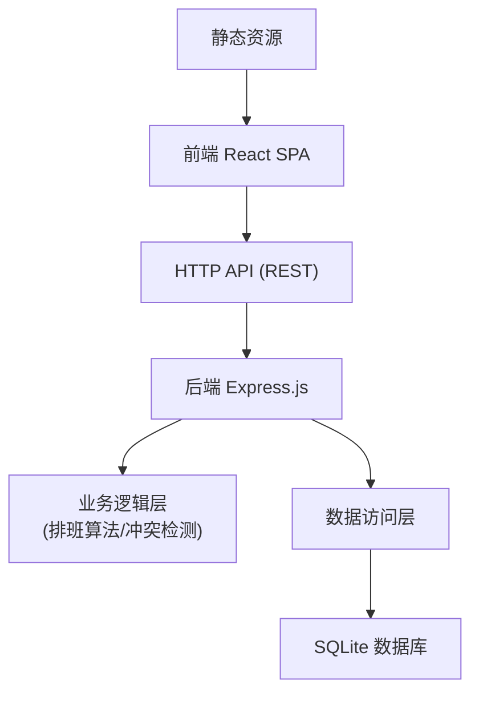
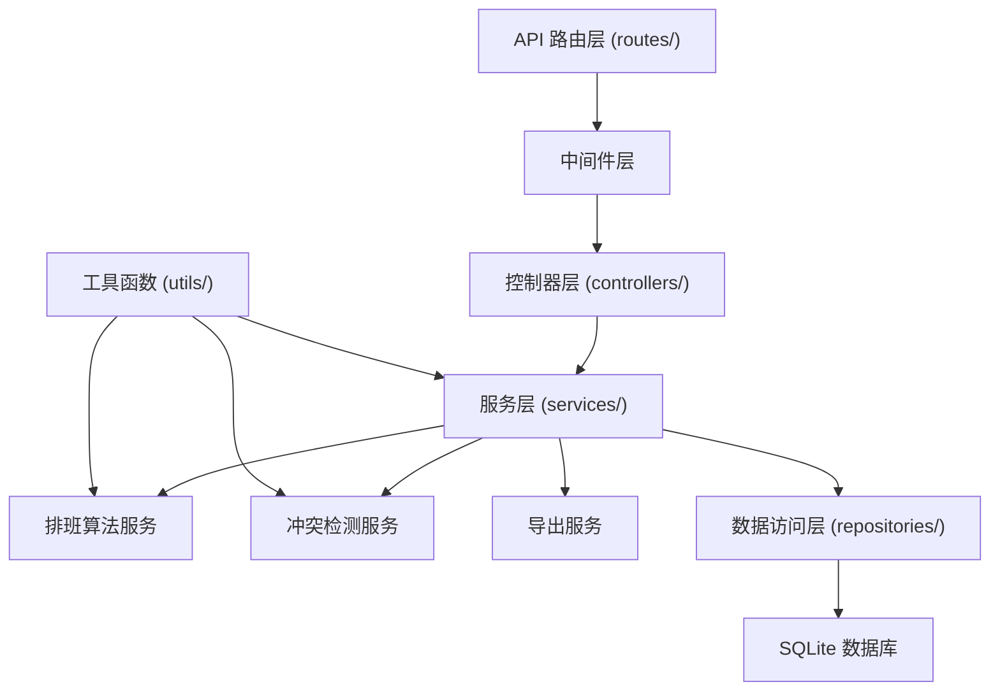

## 1. 架构设计



整体采用前后端分离架构：
- **前端**：React 单页应用，负责UI展示和用户交互
- **后端**：Express.js 提供 RESTful API
- **数据库**：SQLite 存储所有业务数据
- **核心算法**：排班生成算法、冲突检测、均衡分配逻辑在后端业务层实现

## 2. 技术描述

- **前端**：React@18 + TypeScript + Vite + React Router@6 + TailwindCSS@3 + Lucide React (图标) + Recharts (图表)
- **状态管理**：React Context + useReducer (轻量级状态管理)
- **HTTP客户端**：Axios
- **初始化工具**：Vite 官方脚手架
- **后端**：Node.js + Express@4 + TypeScript
- **数据库**：SQLite3 + better-sqlite3 (同步API，性能更优)
- **开发工具**：concurrently (同时运行前后端) + nodemon (后端热重载)
- **代码规范**：ESLint + Prettier

## 3. 前端路由定义

| 路由路径 | 页面名称 | 功能说明 |
|----------|----------|----------|
| `/` | 仪表盘 | 排班概览、统计数据、快捷操作 |
| `/members` | 成员管理 | 成员列表、增删改、设置不可值班日期 |
| `/settings` | 排班设置 | 配置排班周期、人数、算法参数 |
| `/schedule` | 排班表 | 日历视图、生成排班、调班、请假标记 |
| `/export` | 导出中心 | CSV导出功能 |

## 4. 后端API定义

### 4.1 TypeScript 类型定义

```typescript
// 成员
interface Member {
  id: number;
  name: string;
  department?: string;
  email?: string;
  phone?: string;
  createdAt: string;
}

// 不可值班日期
interface UnavailableDate {
  id: number;
  memberId: number;
  date: string; // YYYY-MM-DD
  reason?: string;
  createdAt: string;
}

// 排班配置
interface ScheduleConfig {
  id: number;
  startDate: string; // YYYY-MM-DD
  cycleDays: number; // 排班周期天数
  dailyRequired: number; // 每日所需人数
  maxConsecutiveDays: number; // 最大连续值班天数
  balanceWeight: number; // 均衡度权重 0-100
  createdAt: string;
  updatedAt: string;
}

// 排班记录
interface Schedule {
  id: number;
  date: string; // YYYY-MM-DD
  memberId: number;
  isLeave: boolean; // 是否请假
  leaveType?: string; // 请假类型
  substituteId?: number; // 代班人ID
  createdAt: string;
  updatedAt: string;
}

// 排班生成结果
interface ScheduleGenerateResult {
  success: boolean;
  schedules: Schedule[];
  conflicts: Conflict[];
  statistics: ScheduleStatistics;
}

// 冲突信息
interface Conflict {
  type: 'consecutive' | 'unavailable' | 'insufficient' | 'imbalance';
  severity: 'warning' | 'error';
  date?: string;
  memberId?: number;
  message: string;
}

// 统计信息
interface ScheduleStatistics {
  totalDays: number;
  totalShifts: number;
  memberShifts: { memberId: number; memberName: string; count: number }[];
  maxConsecutive: number;
}
```

### 4.2 API 接口定义

| 方法 | 路径 | 功能 | 请求体 | 响应 |
|------|------|------|--------|------|
| GET | `/api/members` | 获取成员列表 | - | `Member[]` |
| POST | `/api/members` | 新增成员 | `{ name, department?, email?, phone? }` | `Member` |
| PUT | `/api/members/:id` | 更新成员 | `{ name, department?, email?, phone? }` | `Member` |
| DELETE | `/api/members/:id` | 删除成员 | - | `{ success: boolean }` |
| GET | `/api/members/:id/unavailable` | 获取成员不可值班日期 | - | `UnavailableDate[]` |
| POST | `/api/members/:id/unavailable` | 添加不可值班日期 | `{ date, reason? }` 或 `{ startDate, endDate, reason? }` | `UnavailableDate[]` |
| DELETE | `/api/members/unavailable/:id` | 删除不可值班日期 | - | `{ success: boolean }` |
| GET | `/api/config` | 获取排班配置 | - | `ScheduleConfig` |
| PUT | `/api/config` | 更新排班配置 | `ScheduleConfig` | `ScheduleConfig` |
| GET | `/api/schedules` | 获取排班列表 | Query: `startDate, endDate` | `Schedule[]` |
| POST | `/api/schedules/generate` | 生成排班 | `{ startDate?, cycleDays?, dailyRequired? }` | `ScheduleGenerateResult` |
| POST | `/api/schedules/swap` | 调班（交换两人班次） | `{ scheduleId1, scheduleId2 }` | `{ success: boolean, schedules: Schedule[], conflicts: Conflict[] }` |
| POST | `/api/schedules/replace` | 调班（替换单人） | `{ scheduleId, newMemberId }` | `{ success: boolean, schedules: Schedule[], conflicts: Conflict[] }` |
| POST | `/api/schedules/leave` | 标记请假 | `{ scheduleId, leaveType, substituteId? }` | `Schedule` |
| DELETE | `/api/schedules/leave/:id` | 取消请假 | - | `Schedule` |
| GET | `/api/schedules/conflicts` | 检测排班冲突 | Query: `startDate, endDate` | `Conflict[]` |
| GET | `/api/export/csv` | 导出CSV | Query: `startDate, endDate` | CSV 文件 |
| GET | `/api/statistics` | 获取统计数据 | - | `ScheduleStatistics` |

## 5. 服务器架构图



### 目录结构

```
server/
├── src/
│   ├── config/           # 配置文件
│   │   └── database.ts   # 数据库连接
│   ├── controllers/      # 控制器
│   │   ├── member.controller.ts
│   │   ├── schedule.controller.ts
│   │   ├── config.controller.ts
│   │   └── export.controller.ts
│   ├── services/         # 业务逻辑
│   │   ├── member.service.ts
│   │   ├── schedule.service.ts
│   │   ├── scheduling.algorithm.ts  # 排班算法
│   │   ├── conflict.detector.ts     # 冲突检测
│   │   └── export.service.ts
│   ├── repositories/     # 数据访问
│   │   ├── member.repository.ts
│   │   ├── schedule.repository.ts
│   │   └── config.repository.ts
│   ├── routes/           # 路由定义
│   │   ├── member.routes.ts
│   │   ├── schedule.routes.ts
│   │   ├── config.routes.ts
│   │   └── export.routes.ts
│   ├── middleware/       # 中间件
│   │   ├── error.handler.ts
│   │   └── validator.ts
│   ├── types/            # 类型定义
│   │   └── index.ts
│   ├── utils/            # 工具函数
│   │   ├── date.utils.ts
│   │   └── csv.utils.ts
│   ├── database/         # 数据库初始化
│   │   ├── schema.sql
│   │   └── init.ts
│   └── index.ts          # 入口文件
├── data/                 # SQLite 数据库文件
│   └── schedule.db
├── package.json
└── tsconfig.json
```

## 6. 数据模型

### 6.1 ER 图

```mermaid
erDiagram
    MEMBER ||--o{ UNAVAILABLE_DATE : has
    MEMBER ||--o{ SCHEDULE : "assigned to"
    SCHEDULE ||--o| SCHEDULE : "substituted by"
    SCHEDULE_CONFIG ||--o{ SCHEDULE : "generates"

    MEMBER {
        INTEGER id PK
        VARCHAR name NOT NULL
        VARCHAR department
        VARCHAR email
        VARCHAR phone
        DATETIME created_at DEFAULT_CURRENT_TIMESTAMP
    }

    UNAVAILABLE_DATE {
        INTEGER id PK
        INTEGER member_id FK
        DATE date NOT NULL
        VARCHAR reason
        DATETIME created_at DEFAULT_CURRENT_TIMESTAMP
    }

    SCHEDULE_CONFIG {
        INTEGER id PK
        DATE start_date NOT NULL
        INTEGER cycle_days DEFAULT 7
        INTEGER daily_required DEFAULT 1
        INTEGER max_consecutive_days DEFAULT 2
        INTEGER balance_weight DEFAULT 80
        DATETIME created_at DEFAULT_CURRENT_TIMESTAMP
        DATETIME updated_at DEFAULT_CURRENT_TIMESTAMP
    }

    SCHEDULE {
        INTEGER id PK
        DATE date NOT NULL
        INTEGER member_id FK
        BOOLEAN is_leave DEFAULT false
        VARCHAR leave_type
        INTEGER substitute_id FK
        DATETIME created_at DEFAULT_CURRENT_TIMESTAMP
        DATETIME updated_at DEFAULT_CURRENT_TIMESTAMP
    }
```

### 6.2 DDL 语句

```sql
-- 成员表
CREATE TABLE IF NOT EXISTS members (
  id INTEGER PRIMARY KEY AUTOINCREMENT,
  name VARCHAR(100) NOT NULL,
  department VARCHAR(100),
  email VARCHAR(100),
  phone VARCHAR(20),
  created_at DATETIME DEFAULT CURRENT_TIMESTAMP
);

-- 不可值班日期表
CREATE TABLE IF NOT EXISTS unavailable_dates (
  id INTEGER PRIMARY KEY AUTOINCREMENT,
  member_id INTEGER NOT NULL,
  date DATE NOT NULL,
  reason VARCHAR(255),
  created_at DATETIME DEFAULT CURRENT_TIMESTAMP,
  FOREIGN KEY (member_id) REFERENCES members(id) ON DELETE CASCADE
);

-- 排班配置表
CREATE TABLE IF NOT EXISTS schedule_config (
  id INTEGER PRIMARY KEY AUTOINCREMENT,
  start_date DATE NOT NULL,
  cycle_days INTEGER NOT NULL DEFAULT 7,
  daily_required INTEGER NOT NULL DEFAULT 1,
  max_consecutive_days INTEGER NOT NULL DEFAULT 2,
  balance_weight INTEGER NOT NULL DEFAULT 80,
  created_at DATETIME DEFAULT CURRENT_TIMESTAMP,
  updated_at DATETIME DEFAULT CURRENT_TIMESTAMP
);

-- 排班表
CREATE TABLE IF NOT EXISTS schedules (
  id INTEGER PRIMARY KEY AUTOINCREMENT,
  date DATE NOT NULL,
  member_id INTEGER NOT NULL,
  is_leave BOOLEAN NOT NULL DEFAULT 0,
  leave_type VARCHAR(50),
  substitute_id INTEGER,
  created_at DATETIME DEFAULT CURRENT_TIMESTAMP,
  updated_at DATETIME DEFAULT CURRENT_TIMESTAMP,
  FOREIGN KEY (member_id) REFERENCES members(id),
  FOREIGN KEY (substitute_id) REFERENCES members(id)
);

-- 索引
CREATE INDEX IF NOT EXISTS idx_schedules_date ON schedules(date);
CREATE INDEX IF NOT EXISTS idx_schedules_member ON schedules(member_id);
CREATE INDEX IF NOT EXISTS idx_unavailable_member ON unavailable_dates(member_id);
CREATE INDEX IF NOT EXISTS idx_unavailable_date ON unavailable_dates(date);

-- 初始配置数据
INSERT OR IGNORE INTO schedule_config 
(id, start_date, cycle_days, daily_required, max_consecutive_days, balance_weight)
VALUES (1, DATE('now', 'weekday 1'), 7, 1, 2, 80);
```

### 6.3 排班算法设计

**核心目标**：
1. 均衡分配：每人值班次数尽量相等
2. 避免连续：同一人不连续值班超过 max_consecutive_days 天
3. 避开不可日期：不在成员不可值班日期安排
4. 人数足够：每天确保 daily_required 人值班

**算法流程**：
```
1. 获取所有成员列表和不可值班日期
2. 初始化每人值班次数计数器为0
3. 按日期顺序遍历排班周期内每一天：
   a. 获取当天可值班的成员（排除不可值班日期）
   b. 按以下优先级排序：
      - 值班次数少的优先（均衡分配）
      - 前一天/两天已值班的降权（避免连续）
      - 随机打乱相同优先级的成员（增加多样性）
   c. 选择前 daily_required 人分配当天值班
   d. 更新值班次数计数器
4. 第二轮优化：检查并调整过于集中的排班
5. 第三轮检查：检测所有冲突并返回
```

**冲突检测规则**：
- `consecutive`: 同一人连续值班超过 max_consecutive_days 天 → error
- `unavailable`: 在成员不可值班日期安排了值班 → error
- `insufficient`: 某天值班人数不足 daily_required → error
- `imbalance`: 最多与最少值班次数差 > 2 → warning
